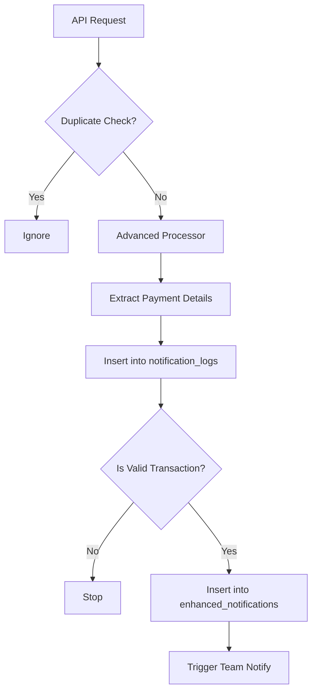

# Notification System Logic: v1 Architecture

This document explains the dual-table architecture used in the v1 Notification API (`/api/notifications/v1`).

## Core Concept
The system uses a **"Raw vs. Clean"** data architecture to ensure no data is lost while providing high-performance access to transaction data.

| Component | Table Name | Purpose |
| :--- | :--- | :--- |
| **Raw Audit Trail** | `notification_logs` | Stores **EVERYTHING**. Used for debugging, auditing, and re-processing. |
| **Clean Data** | `enhanced_notifications` | Stores **VALID TRANSACTIONS**. Used for user-facing lists, analytics, and totals. |

---

## Data Flow Pipeline

When a notification arrives at `POST /api/notifications/v1`, it goes through the following steps:

### 1. Ingestion Phase (`notification_logs`)
**Logic:**
*   Accepts data from the Android App.
*   **Always inserts** a record here first.
*   Captures technical metadata: `processingTimeMs`, `packageName`, raw `text` and `bigText`.
*   Acts as the "Source of Truth" for what the device actually sent.

### 2. Processing Phase (`AdvancedNotificationProcessor`)
**Logic (`lib/services/advanced-notification-processor.ts`):**
*   **Deduplication:** Checks memory cache (`processedNotifications` Set) to prevent duplicate processing within a 1-hour window.
*   **Validation:** Uses `validateUpiNotification` to check if it looks like a payment.
*   **Parsing:** Uses `parseUPINotification` to extract:
    *   `amount` (decimal string)
    *   `payerName` (string)
    *   `transactionType` (RECEIVED/SENT)

### 3. Enhancement Phase (`enhanced_notifications`)
**Logic:**
*   **Condition:** Only inserts if `hasTransaction === true` AND an `amount` was successfully extracted (or provided).
*   **Linking:** Uses `notification_log_id` (not `original_notification_id` which is for legacy migration) to link back to the raw log.
*   **Optimization:** This table is small and clean. Queries for "My Transactions" run against this table, making them very fast.

---

## Key Logic Rules

### Why two tables?
1.  **Performance:** Searching `enhanced_notifications` (1k rows) is faster than `notification_logs` (100k rows of junk/system notifications).
2.  **Safety:** If parsing logic changes or has a bug, we can **Re-Run** processing on `notification_logs` to fix `enhanced_notifications`.
3.  **Auditing:** If a user claims "I didn't get my money", we check `notification_logs` to see if the notification actually arrived but failed parsing.

### Field Mapping
*   **`notification_logs.id`** → Primary Key for the raw event.
*   **`enhanced_notifications.notification_log_id`** → Foreign Key pointing to the raw event.
*   **`enhanced_notifications.original_notification_id`** → **unused** (Legacy field).

### Team Notifications
*   Triggered **ONLY** after successful insertion into `enhanced_notifications`.
*   Uses a `transactionKey` (`txn_{logId}_{amount}`) to prevent sending the same alert twice.

---

## Database Schemas & Column Meanings

### 1. Enhanced Notifications (`enhanced_notifications`)
The high-performance table for displaying "My Transactions".

| Column Name | Type | Description |
| :--- | :--- | :--- |
| `id` | SERIAL (PK) | Unique ID for this specific transaction record. |
| `user_id` | TEXT (FK) | The user who owns this transaction. |
| `notification_id` | TEXT (Unique) | Unique ID generated by the client (app). Used to prevent duplicate inserts of the same notification. |
| `original_notification_id`| INTEGER | **Unused/Legacy**. Intended for migrating data from old v0 system. |
| `notification_log_id` | INTEGER (FK) | **Crucial**. Links this transaction back to the raw `notification_logs` entry. |
| `package_name` | TEXT | The package name of the app (e.g., `com.phonepe.app`). |
| `app_name` | TEXT | Clean, human-readable app name (e.g., "PhonePe"). |
| `title` | TEXT | Notification title (e.g., "Payment Received"). |
| `content` | TEXT | Short text body of the notification. |
| `big_text` | TEXT | Expanded text body (usually contains the full transaction details). |
| `timestamp` | TIMESTAMP | The time the notification appeared on the device. |
| `has_transaction` | BOOLEAN | **Always true** in this table. |
| `amount` | TEXT | The extracted money amount (e.g., "150.00"). Stored as text to avoid floating point errors. |
| `payer_name` | TEXT | The extracted name of the person who sent the money. |
| `transaction_type` | ENUM | `RECEIVED`, `SENT`, or `UNKNOWN`. |
| `processing_time_ms` | INTEGER | How many milliseconds the server took to parse this. |
| `processing_metadata` | JSONB | Extra details about the parsing logic (debug info). |
| `tts_announced` | BOOLEAN | `true` if the app spoke "Received 50 rupees". |
| `team_notification_sent` | BOOLEAN | `true` if a team alert was successfully sent. |

### 2. Notification Logs (`notification_logs`)
The complete audit trail of everything sent by the device.

| Column Name | Type | Description |
| :--- | :--- | :--- |
| `id` | SERIAL (PK) | Unique ID for this log entry. |
| `user_id` | TEXT (FK) | The user who sent this log. |
| `notification_id` | TEXT | Unique ID from client (same as enhanced). |
| `package_name` | TEXT | The raw package name. |
| `app_name` | TEXT | Clean app name. |
| `timestamp` | TIMESTAMP | When it happened. |
| `title` | TEXT | Raw title. |
| `text` | TEXT | Raw text content. |
| `big_text` | TEXT | Raw big text content. |
| `has_transaction` | BOOLEAN | `true` if the system *thought* it found a transaction, `false` otherwise. |
| `amount` | TEXT | The amount we *tried* to extract (might be null if parsing failed). |
| `payer_name` | TEXT | The payer name we *tried* to extract. |
| `transaction_type` | ENUM | What we think the type is. |
| `processing_time_ms` | INTEGER | Performance metric. |
| `tts_announced` | BOOLEAN | Whether TTS was triggered on the device. |
